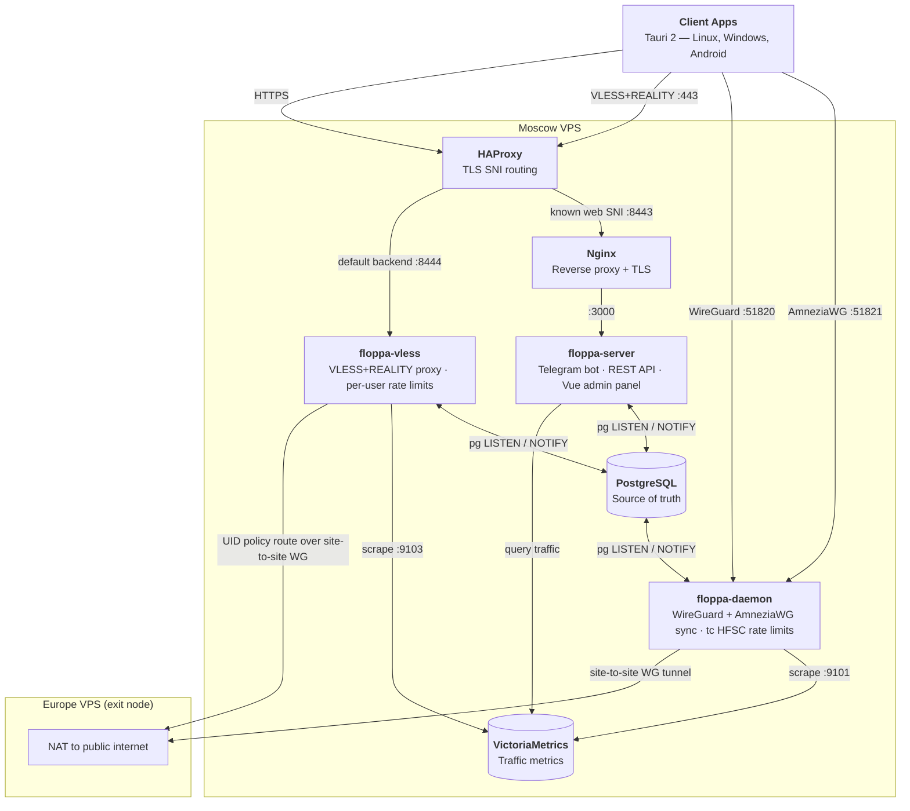
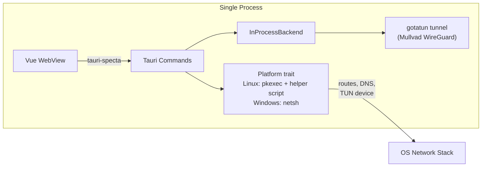
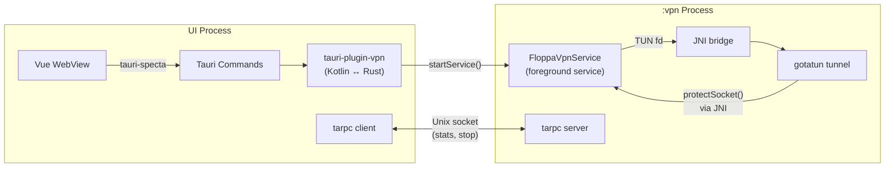
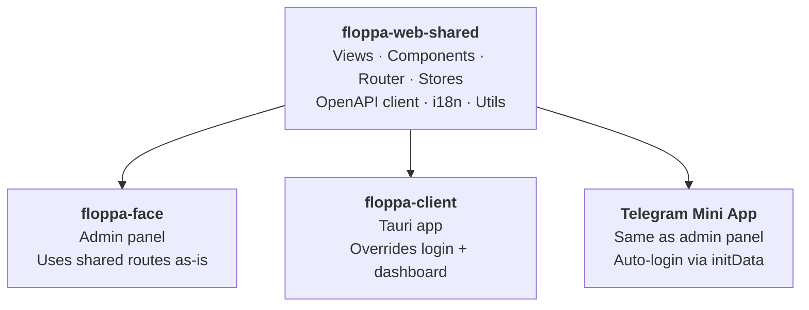

<p align="center">
  
</p>

<h1 align="center">Floppa VPN</h1>

<p align="center">VPN service built with Rust — daemon, Telegram bot, admin panel, and Tauri 2 client app.</p>

[](https://github.com/okhsunrog/floppa-vpn/actions/workflows/ci.yml)

## Architecture

Three tunnel protocols, two VPS regions:

- **AmneziaWG** — the default protocol. WireGuard plus DPI-resistant obfuscation; client connects to Moscow VPS (:51821), traffic routes to Europe VPS via a site-to-site WireGuard tunnel (policy routing + MASQUERADE)
- **WireGuard** — plain WireGuard; client connects to Moscow VPS (:51820), same site-to-site routing to Europe
- **VLESS+REALITY** — client connects to Moscow HAProxy (:443), which forwards non-web TLS to the local REALITY proxy; proxied traffic exits through Europe



**How it works:** Server writes peer changes to PostgreSQL (e.g. `sync_status = 'pending_add'`) → DB trigger fires `pg_notify('peer_changed')` → daemon picks it up, syncs the peer to its protocol's interface (WireGuard via `wg`, AmneziaWG via `awg` — each peer carries a `protocol`), applies rate limits, and marks the peer active. HAProxy on Moscow sends VLESS/REALITY connections to the local `floppa-vless` process, which syncs its user registry from the same local database via `pg LISTEN/NOTIFY`. WireGuard, AmneziaWG, and VLESS egress are policy-routed through the site-to-site tunnel and NATed by Europe. Traffic metrics from both daemon and VLESS are scraped by VictoriaMetrics; the server queries VM to serve traffic stats in the API.

## Features

### Daemon
- Stateless WireGuard + AmneziaWG peer synchronization via `wg set` / `awg set` (one interface per protocol; AmneziaWG adds DPI-resistant obfuscation)
- Per-peer HFSC traffic shaping (bidirectional — egress + IFB ingress)
- Prometheus metrics endpoint — traffic counters scraped by VictoriaMetrics
- Auto-runs database migrations on startup

### VLESS Proxy
- [shoes-lite](https://github.com/okhsunrog/shoes-lite) — VLESS+REALITY with Vision flow control
- Per-user token-bucket rate limiting synced from subscription plans
- Real-time user registry via `pg LISTEN/NOTIFY` + periodic full sync
- Prometheus metrics endpoint for per-user traffic counters
- Constant-time UUID comparison (timing-attack resistant)

### Telegram Bot
- User registration with automatic 7-day trial
- Subscription status, language switching (en/ru)
- Inline button to open the web app

### Admin Panel
- Dashboard with server stats and traffic overview
- User management — create, search, subscription control
- Plan management — speed limits, peer limits, pricing
- Peer monitoring — sync status, traffic, last handshake
- Paginated lists (users, peers, installations, VLESS) — 100 rows/page

### Avatar Caching
Telegram profile photos are served from a CDN that's unreachable from clients in Russia (and sends no CORS headers), so the server downloads each user's photo — via the Bot API (`getUserProfilePhotos` → `getFile`), falling back to the stored `photo_url` — caches it as a blob in PostgreSQL, and serves it from our own origin. Populated on demand (first avatar request triggers a background fetch) with a periodic TTL refresh; the admin user list fetches avatars for the visible page in one batch.

### CLI Client
- Standalone WireGuard / AmneziaWG / VLESS client (`floppa-cli`) for headless/server use (`--protocol`)
- Also used as the tunnel binary for integration tests

### Client App (Tauri 2)
- Cross-platform: Linux, Windows, Android
- AmneziaWG (default), WireGuard, and VLESS+REALITY tunnel support
- Split tunneling with per-app selection (Android)
- WireGuard config persistence via OS keyring (desktop) or encrypted file (Android)
- Deep-link authentication (Telegram Login Widget → JWT)
- Two-process architecture on Android (VPN survives app swipe-close)

## Client Architecture

The client uses trait-based abstraction (`VpnBackend` + `Platform`) to share Tauri commands across platforms while handling OS differences underneath.

**Language split:**

- **Rust** — all VPN logic: WireGuard tunnel (gotatun), VLESS tunnel (shoes-lite), connection management, route/DNS/TUN setup, config persistence, IPC between processes, Tauri commands. The entire `VpnBackend` and `Platform` trait hierarchy is Rust
- **TypeScript / Vue** — UI layer: connection controls, stats display, settings, split tunneling picker, update checks, theme management
- **Kotlin** (Android only) — thin platform bridge via `tauri-plugin-vpn`: VPN service lifecycle, TUN fd creation, `VpnService.Builder` for split tunneling, foreground notification, system API access (battery optimization, notification permissions, status bar style, safe area insets, device name)

### Desktop (Linux, Windows)



Single-process: gotatun runs the WireGuard tunnel in-process. The `Platform` trait handles OS-specific network setup — Linux uses a polkit helper script for privilege escalation, Windows uses `netsh`. Config is persisted in the OS keyring (secret-service / DPAPI). Graceful cleanup on exit restores DNS and routes.

### Android



Two-process model so the VPN survives app swipe-close:

**Single `.so`, two entry points, two processes** — Tauri compiles all Rust code into one `libfloppa_client_lib.so` with two entry points: the standard Tauri/JNI entry for the UI process, and `nativeInit` / `nativeStartTunnel` / `nativeStop` JNI exports for the VPN process. The Kotlin `FloppaVpnService` is declared with `android:process=":vpn"` in the manifest, so Android loads the same `.so` into a separate process. JNI statics (`JAVA_VM`, `TOKIO_RUNTIME`, `TUNNEL_MANAGER`) are per-process — each process gets its own isolated Rust state from the same binary.

**Why tarpc?** Android's standard IPC (AIDL, Messenger) is Java/Kotlin-only — useless when both ends are Rust. gRPC adds HTTP/2 overhead. tarpc is pure Rust, async-native, and works directly over Unix domain sockets with bincode serialization. The UI process connects to `vpn.sock` in the app data directory to query stats or request stop.

**The flow:** `tauri-plugin-vpn` (Kotlin) starts `FloppaVpnService` as a foreground service → service creates TUN via Android's `VpnService.Builder` → passes the raw fd to Rust via JNI (`nativeStartTunnel`) → gotatun starts the WireGuard tunnel using that fd → tarpc server begins listening. When gotatun creates UDP sockets, it calls back into Kotlin via JNI (`protectSocket`) to mark them as bypass — preventing WireGuard packets from routing through the VPN itself. Split tunneling uses Android's per-app VPN API (`addAllowedApplication` / `addDisallowedApplication`).

## Frontend Sharing

Three apps — admin panel (`floppa-face`), Tauri client (`floppa-client`), and Telegram Mini App — share a single codebase via the `floppa-web-shared` package in a Bun workspace.



**How it works:**

- **Shared router** — `createAppRoutes()` returns all routes, `installAuthGuard()` adds auth checks. The admin panel uses them as-is; the client app overrides `login` and `dashboard` routes with its own components
- **Slot-based composition** — shared views expose named slots (e.g. `UserDashboardView` has a `#vpn-widget` slot). The client fills it with `VpnCard`, the admin panel leaves it empty
- **Three auth flows, one component** — the shared `LoginView` handles all three via props:
  - *Admin panel* — embedded Telegram Login Widget (JavaScript callback)
  - *Tauri client* — opens browser for Telegram OAuth, server redirects to `floppa://auth?token=...`, Tauri captures via deep-link plugin
  - *Mini App* — auto-login with `window.Telegram.WebApp.initData` (no user interaction, already authenticated inside Telegram)
- **OpenAPI → Pinia Colada** — the server generates an OpenAPI spec via utoipa, `@hey-api/openapi-ts` generates a typed SDK + Pinia Colada query/mutation hooks. All apps share the same auto-generated API client
- **Nuxt UI v4 without Nuxt** — used as a Vue plugin (`@nuxt/ui/vue-plugin`) for the component library without the full Nuxt framework
- **Tailwind v4 cross-scanning** — each app's CSS includes `@source "../../floppa-web-shared/src"` so Tailwind picks up classes from shared components

## Tech Stack

| Layer | Tech |
|-------|------|
| Server | Rust, Axum, teloxide, sqlx, utoipa (OpenAPI), memory-serve |
| Daemon | Rust, WireGuard (`wg`) + AmneziaWG (`awg`, kernel DKMS module), Linux tc HFSC, Prometheus metrics |
| VLESS Proxy | Rust, [shoes-lite](https://github.com/okhsunrog/shoes-lite) (VLESS+REALITY+Vision), Prometheus metrics |
| Frontend | Vue 3, Nuxt UI v4, Pinia Colada, Tailwind v4 |
| Client | Tauri 2, gotatun (Mullvad WireGuard + AmneziaWG obfuscation), shoes-lite (VLESS), tauri-specta, custom tauri-plugin-vpn |
| Database | PostgreSQL with LISTEN/NOTIFY |
| Metrics | VictoriaMetrics (Prometheus-compatible TSDB) |
| Crypto | x25519-dalek (WG keys), ChaCha20-Poly1305 (storage), XTLS REALITY, JWT |

## Development

```bash
# Prerequisites: Rust toolchain, Vite+ (`vp`), just

# Install frontend dependencies
vp install

# Run all checks (fmt, clippy, tests, type-check, lint)
just check

# Dev servers
cd floppa-face && vp dev               # Admin panel (proxies /api → :3000)
cd floppa-client && vp exec tauri dev  # Client app

# Regenerate OpenAPI TypeScript client
just openapi

# Build Android APK
just build-android

# Build deployment archive (frontend + server binaries)
just package
```

## Deployment

See [DEPLOYMENT.md](docs/DEPLOYMENT.md) for the full guide. Ansible deploys across two VPS regions:

- **Moscow** — `floppa-daemon` (root, WireGuard + tc), `floppa-server` (bot + API + embedded frontend), `floppa-vless` behind HAProxy, VictoriaMetrics, Grafana, nginx with Let's Encrypt
- **Europe** — site-to-site WireGuard endpoint and NAT exit for all VPN protocols

## License

[GPL-3.0](LICENSE)
