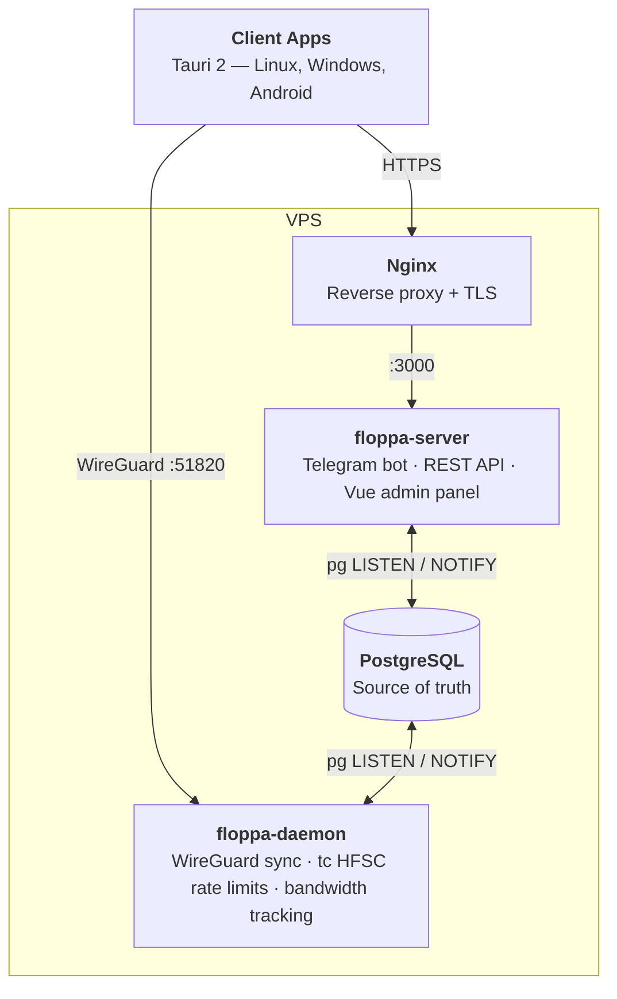

# Floppa VPN

WireGuard VPN service built with Rust — daemon, Telegram bot, admin panel, and Tauri 2 client app.

[](https://github.com/okhsunrog/floppa-vpn/actions/workflows/ci.yml)

## Architecture



**How it works:** Server writes peer changes to PostgreSQL (e.g. `sync_status = 'pending_add'`) → DB trigger fires `pg_notify('peer_changed')` → daemon picks it up, syncs WireGuard, applies rate limits, and marks peer as `active`. All state lives in the database.

## Features

### Daemon
- Stateless WireGuard peer synchronization via `wg set`
- Per-peer HFSC traffic shaping (bidirectional — egress + IFB ingress)
- Bandwidth tracking from `wg show dump`
- Auto-runs database migrations on startup

### Telegram Bot
- User registration with automatic 7-day trial
- Subscription status, language switching (en/ru)
- Inline button to open the web app

### Admin Panel
- Dashboard with server stats and traffic overview
- User management — create, search, subscription control
- Plan management — speed limits, traffic caps, peer limits, pricing
- Peer monitoring — sync status, traffic, last handshake

### Client App (Tauri 2)
- Cross-platform: Linux, Windows, Android
- Split tunneling with per-app selection (Android)
- WireGuard config persistence via OS keyring (desktop) or encrypted file (Android)
- Deep-link authentication (Telegram Login Widget → JWT)
- Two-process architecture on Android (VPN survives app swipe-close)

## Tech Stack

| Layer | Tech |
|-------|------|
| Server | Rust, Axum, teloxide, sqlx, utoipa (OpenAPI), memory-serve |
| Daemon | Rust, WireGuard (`wg`), Linux tc, sqlx |
| Frontend | Vue 3, Nuxt UI v4, Pinia Colada, Tailwind v4 |
| Client | Tauri 2, gotatun (Mullvad WireGuard), tauri-specta (type-safe bindings) |
| Database | PostgreSQL with LISTEN/NOTIFY |
| Crypto | x25519-dalek (WG keys), ChaCha20-Poly1305 (storage), JWT |

## Development

```bash
# Prerequisites: Rust toolchain, bun, just

# Install frontend dependencies
bun install

# Run all checks (fmt, clippy, tests, type-check, lint)
just check

# Dev servers
cd floppa-face && bun dev        # Admin panel (proxies /api → :3000)
cd floppa-client && bun dev      # Client app

# Regenerate OpenAPI TypeScript client
just openapi

# Build Android APK
just build-android

# Build deployment archive (frontend + server binaries)
just package
```

## Deployment

See [DEPLOYMENT.md](DEPLOYMENT.md) for the full guide. TL;DR: Ansible deploys three systemd services — `floppa-daemon` (root, WireGuard + tc), `floppa-server` (bot + API + embedded frontend), and nginx as reverse proxy with Let's Encrypt.

## License

[GPL-3.0](LICENSE)
